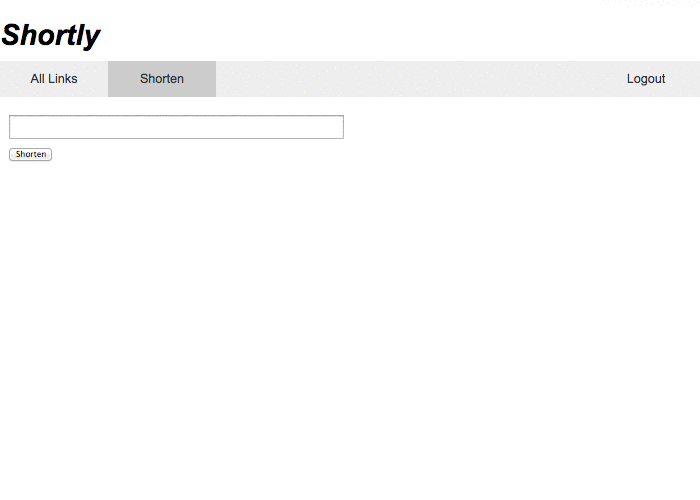

# shortly-express

### Summary

Shortly is a URL shortener service similar to Bitly - but is only partially finished. It is a full stack application with an authentication system and other features that will enable users to have their own private set of shortened URLs.

The application has:

- Usernames and Passwords
- Sessions and Cookies
- Authenticated Routes
- Testing

